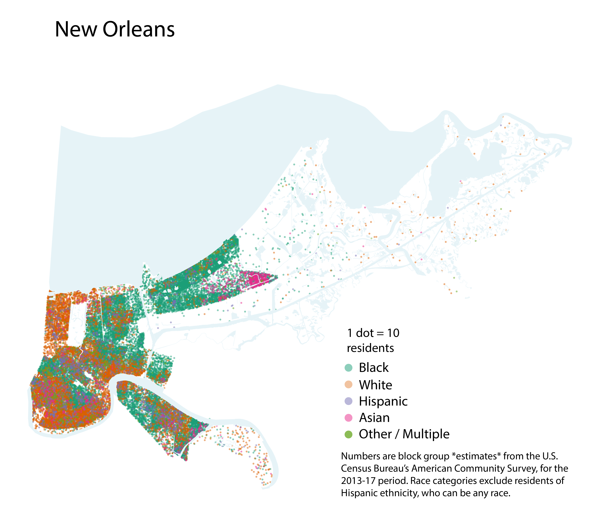

# Plots with dots

## Dot density maps in R tutorials

["Dot Density Maps"](https://tarakc02.github.io/dot-density/) by Tarak Shah

["Ethnic Groups by Ward"](https://www.trafforddatalab.io/info/demographics/ethnicity/index.html) by Trafford Data Lab

["Multivariate Dot Density Maps in R with `sf` and `ggplot2`"](https://www.cultureofinsight.com/blog/2018/05/02/2018-04-08-multivariate-dot-density-maps-in-r-with-sf-ggplot2/) by Paul Campbell

["Dot Density Maps in R"](http://web.stanford.edu/~cengel/cgi-bin/anthrospace/dot-density-maps-in-r)(note: uses `maptools`, rather than `sf` - I ended up using `sf`)

## Spatial data in R tutorials

["Spatial analysis"](https://learn.r-journalism.com/en/mapping/) by Andrew Ba Tran

["Spatial data in tidycensus"](https://walkerke.github.io/tidycensus/articles/spatial-data.html) by Kyle Walker (note: `st_erase` function for removing water areas)

## Limitations (one way or another, all maps lie)

["Applied Spatial Statistics for Public Health Data"](https://epdf.tips/applied-spatial-statistics-for-public-health-data.html) by Lance A. Waller and Carol A. Gotway p. 83: 
> "While dot density maps most often assign multiple events to each dot (e.g., a single dot represents 100 cases), **we find the visual temptation to interpret mapped dots as actual case locations to be far too strong** to recommend use of dot density maps for public health applications."

["America is not that segregated!"](https://msu.edu/~kg/nytimes_dotdensity.htm) by Kirk Goldsberry (in response to ["Mapping Segregation"](https://www.nytimes.com/interactive/2015/07/08/us/census-race-map.html))
> "In suburban and rural areas, **dots frequently appear in uninhabitable zones** such as lakes, rivers, canyons, and national forests. This causes readers to not only wonder how people could live in, on, or under lakes, but also to mistakenly believe that the habitable portions of these tracts are more sparsely populated than they actually are." (note: that's why `st_erase` is important, it at least removes lakes/rivers!)
  
> " ... using these techniques [one dot for every fifty individuals of a particular race], even the most diversely populated, integrated census tracts will appear quite segregated. For example, imagine a hypothetical suburban census tract with exactly 50 white residents and 50 black residents. The software would place two dots randomly (likely separated by a large distance) within that tract, one for the white residents, one for the black. Unfortunately, **even though in reality this tract could be quite integrated, your map would depict it as severely segregated – that’s a problem.**"
  
> "Here's how one textbook ([Slocum et al 2009](https://www.amazon.com/Thematic-Cartography-Geovisualization-Terry-Slocum/dp/0132298341)) describes how to make a dot map: The first step is to delineate regions in which within which the phenomenon being mapped (human beings in this case) is located; ideally this step considers ancillary information that can assist in determining appropriate locations for dots."

## Inspiration

["America is more diverse than ever — but still segregated"](https://www.washingtonpost.com/graphics/2018/national/segregation-us-cities/) by Aaron Williams and Armand Emamdjomeh

["French Kisses"](http://www.radicalcartography.net/index.html?frenchkisses) by Bill Rankin

["Mapping Segregation"](https://www.nytimes.com/interactive/2015/07/08/us/census-race-map.html) by Matthew Bloch, Amanda Cox and Tom Giratikanon

["The Racial Dot Map"](https://demographics.coopercenter.org/racial-dot-map) by Dustin Cable

["2010 Census: Children less than five years old"](http://media.apps.chicagotribune.com/chicago-census/less-than-five.html) by Chris Groskopf and Brian Boyer

["2016 Election Map"](https://xkcd.com/1939/) by Randall Munroe aka xkcd

